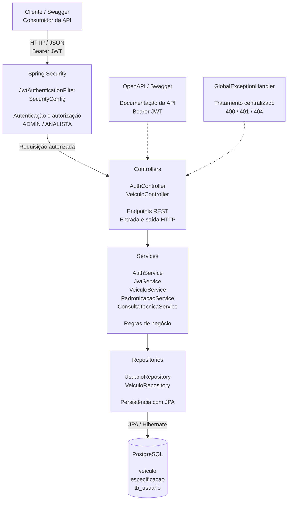
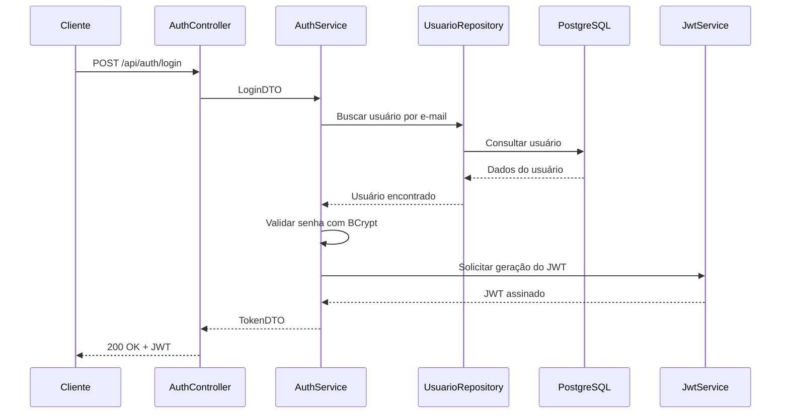
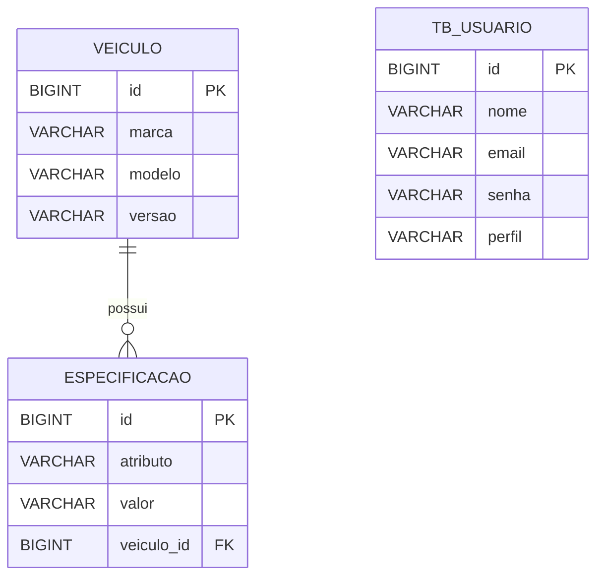

# 🚗 AutoSpec API

API REST desenvolvida para o **Challenge Ford-FIAP**, na disciplina de **Arquitetura Orientada a Serviços e Web Services**, do curso de Engenharia de Software da FIAP.

O **AutoSpec** é uma solução de inteligência competitiva automotiva criada para organizar, consultar e padronizar informações técnicas de veículos, permitindo que dados de diferentes modelos e versões sejam estruturados de maneira consistente para análise e comparação.

A solução foi desenvolvida utilizando **Java, Spring Boot, PostgreSQL e Spring Security**, contando com autenticação e autorização via **JWT**, controle de acesso baseado em perfis, documentação OpenAPI/Swagger, migrations com Flyway, tratamento padronizado de erros e testes automatizados.

---

## 👥 Integrantes

| Integrante | RM |
|---|---|
| Augusto Mendonça | RM558371 |
| Gabriel Vasquez | RM557056 |
| Gustavo Oliveira | RM559163 |

---

# 📑 Sumário

- [Objetivo](#-objetivo)
- [Funcionalidades](#-funcionalidades)
- [Tecnologias](#️-tecnologias)
- [Arquitetura da Solução](#️-arquitetura-da-solução)
- [Fluxo de Autenticação](#-fluxo-de-autenticação)
- [Autenticação e JWT](#-autenticação-e-jwt)
- [Perfis e Autorizações](#-perfis-e-autorizações)
- [API REST](#-api-rest)
- [Status HTTP](#-status-http)
- [Tratamento de Erros](#️-tratamento-de-erros)
- [Banco de Dados e Flyway](#️-banco-de-dados-e-flyway)
- [Swagger / OpenAPI](#-swagger--openapi)
- [Configuração](#️-configuração)
- [Execução](#️-execução)
- [Testes Automatizados](#-testes-automatizados)
- [Estrutura do Projeto](#-estrutura-do-projeto)
- [Requisitos Atendidos](#-requisitos-atendidos)
- [Considerações de Segurança](#-considerações-de-segurança)

---

# 🎯 Objetivo

O objetivo do AutoSpec é fornecer uma ferramenta capaz de receber e organizar dados técnicos de veículos de maneira padronizada.

A solução busca facilitar atividades de inteligência competitiva automotiva, permitindo estruturar informações de **marca, modelo, versão e especificações técnicas** para posterior consulta e comparação.

O projeto também demonstra conceitos relacionados a:

- Arquitetura orientada a serviços;
- Desenvolvimento de APIs REST;
- Separação de responsabilidades;
- Persistência de dados;
- Autenticação e autorização;
- JSON Web Token;
- Controle de acesso baseado em perfis;
- Documentação de APIs;
- Tratamento de erros;
- Testes automatizados.

---

# ⚙️ Funcionalidades

Entre as principais funcionalidades implementadas estão:

- Cadastro de veículos;
- Consulta de veículos;
- Atualização de veículos;
- Exclusão de veículos;
- Armazenamento de especificações técnicas;
- Padronização de informações técnicas;
- Consulta técnica;
- Cadastro e persistência de usuários;
- Autenticação por e-mail e senha;
- Geração de JWT;
- Validação de JWT;
- Expiração de tokens;
- Autorização baseada em perfis;
- Endpoints públicos e protegidos;
- Tratamento centralizado de erros;
- Documentação com Swagger/OpenAPI;
- Versionamento do banco com Flyway;
- Testes automatizados de autenticação e segurança.

---

# 🛠️ Tecnologias

A solução utiliza as seguintes tecnologias:

| Tecnologia | Utilização |
|---|---|
| Java | Linguagem principal |
| Spring Boot 4.0.6 | Framework da aplicação |
| Spring Web MVC | Construção da API REST |
| Spring Data JPA | Persistência |
| Spring Security | Autenticação e autorização |
| JJWT | Geração e validação de JWT |
| BCrypt | Hash das senhas |
| PostgreSQL | Banco de dados relacional |
| Flyway | Versionamento do banco |
| Jakarta Validation | Validação dos DTOs |
| OpenAPI / Swagger | Documentação da API |
| Maven | Gerenciamento de dependências |
| JUnit | Testes automatizados |
| MockMvc | Testes dos endpoints HTTP |

---

# 🏗️ Arquitetura da Solução

A aplicação utiliza uma arquitetura em camadas, separando as responsabilidades de segurança, apresentação, regras de negócio, persistência e armazenamento dos dados.

O fluxo principal pode ser representado da seguinte forma:



## Responsabilidades das camadas

### Controllers

Os Controllers representam a camada de entrada da API.

São responsáveis por:

- Receber requisições HTTP;
- Receber e validar DTOs;
- Encaminhar operações para os Services;
- Retornar respostas e status HTTP adequados.

Entre os Controllers utilizados estão:

```text
AuthController
VeiculoController
```

### Services

A camada de Services concentra as regras de negócio da aplicação.

Entre os serviços estão:

```text
AuthService
JwtService
VeiculoService
PadronizacaoService
ConsultaTecnicaService
```

As responsabilidades incluem autenticação, geração de tokens, gerenciamento de veículos, padronização e consultas técnicas.

### Repositories

Os Repositories realizam a comunicação entre a aplicação e o banco de dados através do Spring Data JPA.

Entre eles estão:

```text
UsuarioRepository
VeiculoRepository
```

### Security

A camada de segurança é responsável pela autenticação e autorização das requisições.

Os principais componentes são:

```text
SecurityConfig
JwtAuthenticationFilter
JwtService
```

### Banco de Dados

O PostgreSQL é responsável pela persistência das informações da aplicação.

A evolução da estrutura do banco é controlada pelo Flyway.

---

# 🔄 Fluxo de Autenticação

O processo de autenticação começa quando o cliente envia suas credenciais para o endpoint de login.



Depois de autenticado, o cliente deve utilizar o token nas requisições protegidas.

```text
Cliente
   │
   │ Authorization: Bearer <JWT>
   ▼
JwtAuthenticationFilter
   │
   ├── JWT ausente/inválido
   │       │
   │       └──► 401 Unauthorized
   │
   └── JWT válido
           │
           ▼
     Spring Security
           │
           ├── Perfil sem permissão
           │       │
           │       └──► 403 Forbidden
           │
           └── Operação autorizada
                   │
                   ▼
               Controller
                   │
                   ▼
                Service
                   │
                   ▼
              Repository
                   │
                   ▼
               PostgreSQL
```

---

# 🔐 Autenticação e JWT

A API utiliza **JSON Web Token (JWT)** para autenticação stateless.

O endpoint de login é:

```http
POST /api/auth/login
```

Exemplo de requisição:

```json
{
  "email": "admin@autospec.com",
  "senha": "Admin123"
}
```

Quando as credenciais são válidas, a aplicação retorna um `TokenDTO`.

Exemplo:

```json
{
  "token": "eyJ...",
  "tipo": "Bearer",
  "expiraEm": 3600000
}
```

O token deve ser enviado nas requisições protegidas através do header:

```http
Authorization: Bearer <token>
```

O JWT contém informações utilizadas pela aplicação para identificar o usuário e seu perfil.

O token possui tempo de expiração configurado, evitando que permaneça válido indefinidamente.

---

# 👤 Perfis e Autorizações

A aplicação possui dois perfis:

```text
ADMIN
ANALISTA
```

## ADMIN

O perfil `ADMIN` possui acesso às operações de consulta e manutenção dos veículos.

| Método | Operação | Permitido |
|---|---|:---:|
| GET | Consultar | ✅ |
| POST | Cadastrar | ✅ |
| PUT | Atualizar | ✅ |
| DELETE | Excluir | ✅ |

## ANALISTA

O perfil `ANALISTA` possui acesso às operações de consulta.

| Método | Operação | Permitido |
|---|---|:---:|
| GET | Consultar | ✅ |
| POST | Cadastrar | ❌ |
| PUT | Atualizar | ❌ |
| DELETE | Excluir | ❌ |

Exemplos:

```text
ANALISTA + GET    → 200 OK
ANALISTA + DELETE → 403 Forbidden

ADMIN + GET       → 200 OK
ADMIN + POST      → permitido
ADMIN + PUT       → permitido
ADMIN + DELETE    → permitido
```

---

# 🌐 API REST

A API utiliza recursos identificados por URI e métodos HTTP adequados às operações executadas.

## Autenticação

| Método | Endpoint | Descrição | Acesso |
|---|---|---|---|
| POST | `/api/auth/login` | Autenticar usuário e gerar JWT | Público |

## Veículos

| Método | Endpoint | Descrição | Acesso |
|---|---|---|---|
| POST | `/api/veiculos` | Cadastrar veículo | ADMIN |
| GET | `/api/veiculos` | Listar veículos | ADMIN / ANALISTA |
| GET | `/api/veiculos/{id}` | Consultar veículo por ID | ADMIN / ANALISTA |
| PUT | `/api/veiculos/{id}` | Atualizar veículo | ADMIN |
| DELETE | `/api/veiculos/{id}` | Excluir veículo | ADMIN |

Essa estrutura utiliza os métodos HTTP de acordo com a semântica da operação:

```text
GET    → Consulta
POST   → Criação
PUT    → Atualização
DELETE → Exclusão
```

---

# 📊 Status HTTP

A aplicação utiliza status HTTP coerentes com o resultado das operações.

| Status | Descrição |
|---|---|
| `200 OK` | Requisição realizada com sucesso |
| `201 Created` | Recurso criado com sucesso |
| `204 No Content` | Recurso excluído com sucesso |
| `400 Bad Request` | Dados de entrada inválidos |
| `401 Unauthorized` | Autenticação ausente ou credenciais inválidas |
| `403 Forbidden` | Usuário autenticado sem permissão |
| `404 Not Found` | Recurso solicitado não encontrado |

---

# ⚠️ Tratamento de Erros

A aplicação possui tratamento centralizado de exceções através do:

```text
GlobalExceptionHandler
```

Isso permite que as respostas de erro mantenham uma estrutura padronizada.

## 400 — Bad Request

Ocorre quando os dados enviados não atendem às validações definidas.

Exemplo:

```json
{
  "email": "",
  "senha": ""
}
```

Resposta:

```json
{
  "status": 400,
  "erros": [
    "email: não deve estar em branco",
    "senha: não deve estar em branco"
  ]
}
```

## 401 — Unauthorized

Pode ocorrer quando:

- As credenciais de login estão incorretas;
- Uma requisição protegida é realizada sem autenticação válida.

Exemplo de erro de credenciais:

```json
{
  "status": 401,
  "erros": [
    "E-mail ou senha inválidos"
  ]
}
```

## 403 — Forbidden

Ocorre quando o usuário está autenticado, mas não possui permissão para executar determinada operação.

Exemplo:

```text
ANALISTA tentando executar DELETE
            ↓
      403 Forbidden
```

## 404 — Not Found

Ocorre quando um recurso solicitado não existe.

O tratamento é realizado através da:

```text
RecursoNaoEncontradoException
```

---

# 🗄️ Banco de Dados e Flyway

A aplicação utiliza **PostgreSQL** como banco de dados relacional.

O versionamento e a evolução da estrutura do banco são realizados através do **Flyway**.

As migrations atuais são:

```text
db/migration
│
├── V1__create_table_vehicle.sql
├── V2__create_table_especificacao.sql
└── V3__criar_tabela_usuario.sql
```

## Tabela `veiculo`

A primeira migration cria a tabela:

```sql
CREATE TABLE veiculo (
    id BIGSERIAL PRIMARY KEY,
    marca VARCHAR(100),
    modelo VARCHAR(100),
    versao VARCHAR(100)
);
```

## Tabela `especificacao`

A segunda migration cria a tabela de especificações:

```sql
CREATE TABLE especificacao (
    id BIGSERIAL PRIMARY KEY,
    atributo VARCHAR(100) NOT NULL,
    valor VARCHAR(255) NOT NULL,
    veiculo_id BIGINT NOT NULL,

    CONSTRAINT fk_veiculo
        FOREIGN KEY (veiculo_id)
        REFERENCES veiculo(id)
);
```

A coluna:

```text
veiculo_id
```

estabelece uma chave estrangeira para:

```text
veiculo(id)
```

Dessa forma, um veículo pode possuir diversas especificações técnicas associadas.

## Tabela `tb_usuario`

A terceira migration adiciona os usuários utilizados na autenticação e autorização.

Sua estrutura contempla:

```text
id
nome
email
senha
perfil
```

O campo `perfil` permite distinguir os usuários:

```text
ADMIN
ANALISTA
```

## Relacionamento principal



As migrations são validadas e executadas automaticamente pelo Flyway durante a inicialização da aplicação.

---

# 📚 Swagger / OpenAPI

A documentação interativa da API é disponibilizada através do Swagger/OpenAPI.

Com a aplicação em execução, acesse:

```text
http://localhost:8080/swagger-ui/index.html
```

O Swagger permite:

- Visualizar os endpoints;
- Consultar os contratos da API;
- Visualizar os DTOs;
- Enviar requisições;
- Realizar autenticação;
- Informar um JWT;
- Testar os endpoints protegidos.

## Autenticação pelo Swagger

Primeiro execute:

```text
POST /api/auth/login
```

Copie o JWT retornado.

Depois:

```text
1. Clique em Authorize
2. Informe o token JWT
3. Confirme a autorização
4. Execute os endpoints protegidos
```

A configuração OpenAPI utiliza o esquema:

```text
bearerAuth
```

com autenticação HTTP do tipo:

```text
Bearer JWT
```

---

# ⚙️ Configuração

## Pré-requisitos

Para executar o projeto é necessário possuir:

- Java configurado;
- Maven;
- PostgreSQL;
- Banco de dados criado;
- Git;
- IntelliJ IDEA ou outra IDE Java compatível.

---

## Configuração do PostgreSQL

Crie o banco utilizado pela aplicação.

Exemplo:

```sql
CREATE DATABASE autospec;
```

Depois configure o arquivo:

```text
src/main/resources/application.properties
```

com os dados correspondentes ao seu ambiente.

Exemplo:

```properties
spring.datasource.url=jdbc:postgresql://localhost:5432/autospec
spring.datasource.username=SEU_USUARIO
spring.datasource.password=SUA_SENHA
```

As credenciais devem ser ajustadas conforme a instalação local do PostgreSQL.

---

## Configuração JWT

A aplicação possui configurações relacionadas à chave utilizada para assinatura e ao tempo de expiração do JWT.

Exemplo de configuração:

```properties
jwt.secret=${JWT_SECRET:SUA_CHAVE_DE_DESENVOLVIMENTO}
jwt.expiration=${JWT_EXPIRATION:3600000}
```

Para ambientes reais, a chave JWT e outras informações sensíveis não devem ser armazenadas diretamente no código-fonte ou publicadas no GitHub.

Prefira utilizar:

- Variáveis de ambiente;
- Secret managers;
- Configurações específicas do ambiente de execução.

---

# ▶️ Execução

Clone o repositório e acesse a pasta do projeto.

Exemplo:

```bash
git clone <URL_DO_REPOSITORIO>
cd <PASTA_DO_PROJETO>
```

Com o PostgreSQL configurado e disponível, execute:

```bash
mvn spring-boot:run
```

Caso o projeto utilize Maven Wrapper no Windows:

```powershell
.\mvnw.cmd spring-boot:run
```

Também é possível executar diretamente a classe principal da aplicação pela IDE.

Após a inicialização:

```text
API:
http://localhost:8080

Swagger:
http://localhost:8080/swagger-ui/index.html
```

Durante a inicialização, o Flyway verifica e aplica as migrations necessárias.

---

# 🧪 Testes Automatizados

A aplicação possui testes automatizados utilizando:

```text
Spring Boot Test
JUnit
MockMvc
Spring Security Test
```

Os testes verificam os principais comportamentos de autenticação, autorização e segurança da API.

## Testes de autenticação

Foram implementados cenários como:

```text
✓ Login com credenciais válidas
  Resultado esperado: 200 OK

✓ Login com senha incorreta
  Resultado esperado: 401 Unauthorized
```

## Testes de segurança

Também são verificados os seguintes cenários:

```text
✓ Requisição sem JWT
  Resultado esperado: 401 Unauthorized

✓ ANALISTA consultando veículos
  Resultado esperado: 200 OK

✓ ANALISTA tentando excluir veículo
  Resultado esperado: 403 Forbidden

✓ ADMIN consultando veículo inexistente
  Resultado esperado: 404 Not Found
```

Também é executado o teste de carregamento do contexto Spring:

```text
contextLoads()
```

## Resultado

Na validação realizada durante o desenvolvimento:

```text
7 tests passed
0 failed
```

Todos os testes executados foram concluídos com sucesso.

## Executando os testes

Com Maven:

```bash
mvn test
```

Ou utilizando Maven Wrapper no Windows:

```powershell
.\mvnw.cmd test
```

Os testes também podem ser executados diretamente pela IDE.

---

# 🧪 Cenários Validados Manualmente

Além dos testes automatizados, os endpoints foram validados através do Swagger.

| Cenário | Resultado esperado |
|---|---|
| Login com campos vazios | `400 Bad Request` |
| Login com senha incorreta | `401 Unauthorized` |
| GET sem JWT | `401 Unauthorized` |
| GET com ANALISTA | `200 OK` |
| DELETE com ANALISTA | `403 Forbidden` |
| GET de ID inexistente com ADMIN | `404 Not Found` |
| POST de veículo com ADMIN | `201 Created` |
| DELETE permitido com ADMIN | `204 No Content` |

---

# 🔒 Segurança

A segurança da aplicação foi implementada utilizando **Spring Security + JWT**.

Entre os mecanismos utilizados estão:

- Autenticação por e-mail e senha;
- Senhas armazenadas utilizando BCrypt;
- JWT assinado;
- Tempo de expiração do token;
- Autenticação stateless;
- Filtro JWT;
- Controle de acesso por perfil;
- Endpoints públicos;
- Endpoints protegidos;
- Respostas `401` para falhas de autenticação;
- Respostas `403` para falhas de autorização.

## Endpoints públicos

O endpoint de autenticação permanece público:

```text
/api/auth/**
```

A documentação também permanece acessível:

```text
/swagger-ui/**
/swagger-ui.html
/v3/api-docs/**
```

Os demais recursos protegidos dependem de autenticação válida.

---

# 📁 Estrutura do Projeto

A estrutura simplificada da aplicação é:

```text
src
├── main
│   ├── java
│   │   └── br.com.fiap.autospec_api
│   │       │
│   │       ├── config
│   │       │   ├── SecurityConfig
│   │       │   ├── OpenApiConfig
│   │       │   └── CargaInicial
│   │       │
│   │       ├── controller
│   │       │   ├── AuthController
│   │       │   └── VeiculoController
│   │       │
│   │       ├── dto
│   │       │   ├── LoginDTO
│   │       │   ├── TokenDTO
│   │       │   └── ...
│   │       │
│   │       ├── exception
│   │       │   ├── GlobalExceptionHandler
│   │       │   ├── RecursoNaoEncontradoException
│   │       │   └── CredenciaisInvalidasException
│   │       │
│   │       ├── model
│   │       │   ├── Usuario
│   │       │   ├── Perfil
│   │       │   └── ...
│   │       │
│   │       ├── repository
│   │       │   ├── UsuarioRepository
│   │       │   └── VeiculoRepository
│   │       │
│   │       ├── security
│   │       │   └── JwtAuthenticationFilter
│   │       │
│   │       └── service
│   │           ├── AuthService
│   │           ├── JwtService
│   │           ├── VeiculoService
│   │           ├── PadronizacaoService
│   │           └── ConsultaTecnicaService
│   │
│   └── resources
│       │
│       ├── db
│       │   └── migration
│       │       ├── V1__create_table_vehicle.sql
│       │       ├── V2__create_table_especificacao.sql
│       │       └── V3__criar_tabela_usuario.sql
│       │
│       └── application.properties
│
└── test
    └── java
        └── br.com.fiap.autospec_api
            ├── AuthControllerTest
            ├── SegurancaControllerTest
            └── ...
```

---

# 🔁 Separação de Responsabilidades

A arquitetura busca evitar o acoplamento direto entre a camada HTTP e a persistência.

O fluxo padrão é:

```text
Controller
    │
    ▼
Service
    │
    ▼
Repository
    │
    ▼
PostgreSQL
```

Para recursos protegidos, existe uma etapa adicional:

```text
Cliente
    │
    ▼
Spring Security
    │
    ▼
JwtAuthenticationFilter
    │
    ▼
Controller
    │
    ▼
Service
    │
    ▼
Repository
    │
    ▼
PostgreSQL
```

Essa separação facilita manutenção, testes e evolução da aplicação.

---

# 📋 Requisitos Atendidos

## 1. Arquitetura da Solução

A solução apresenta:

- Componentes principais identificados;
- Responsabilidades separadas;
- Arquitetura em camadas;
- Fluxo de comunicação documentado;
- Fluxo de autenticação documentado;
- Separação entre Controller, Service e Repository;
- Persistência isolada através dos Repositories.

---

## 2. Autenticação e Autorização

Foram implementados:

- Autenticação de usuários;
- Validação de senha com BCrypt;
- Endpoint público de login;
- Endpoints protegidos;
- Perfil `ADMIN`;
- Perfil `ANALISTA`;
- Controle de acesso por operação;
- Respostas adequadas para acesso não autorizado.

---

## 3. JWT

A implementação contempla:

- Geração de JWT;
- Assinatura do token;
- Validação do token;
- Identificação do usuário;
- Informação de perfil;
- Expiração;
- Bearer Authentication;
- Filtro responsável pelo processamento do JWT;
- Proteção dos recursos através do token.

---

## 4. Maturidade REST — Nível 2

A API apresenta:

- Recursos identificados através de URIs;
- Uso de `GET`;
- Uso de `POST`;
- Uso de `PUT`;
- Uso de `DELETE`;
- Status HTTP coerentes com as operações;
- Separação das operações por recurso.

---

## 5. Testes Automatizados

Foram implementados testes contemplando:

- Cenários de sucesso;
- Cenários de erro;
- Login válido;
- Login inválido;
- Acesso sem autenticação;
- Acesso autorizado;
- Acesso proibido por perfil;
- Recurso inexistente.

A suíte validada possui:

```text
7 testes executados
7 testes aprovados
0 falhas
```

---

## 6. Documentação e Tratamento de Erros

A solução possui:

- Swagger/OpenAPI;
- Documentação dos endpoints;
- Bearer Authentication no Swagger;
- `GlobalExceptionHandler`;
- Tratamento de validação;
- Tratamento de credenciais inválidas;
- Tratamento de recurso inexistente;
- Respostas `401` e `403` configuradas na camada de segurança;
- README com instruções de configuração e execução.

---

# 🛡️ Considerações de Segurança

As credenciais e chaves apresentadas durante o desenvolvimento são destinadas exclusivamente ao ambiente acadêmico/local.

Em um ambiente de produção:

- Senhas do banco não devem ser versionadas;
- Chaves JWT não devem ser publicadas;
- Secrets devem utilizar variáveis de ambiente ou serviço apropriado;
- Usuários de demonstração não devem utilizar credenciais previsíveis;
- HTTPS deve ser utilizado para transmissão dos tokens;
- Configurações devem ser separadas por ambiente.

Arquivos contendo informações sensíveis devem ser protegidos adequadamente e, quando necessário, incluídos no `.gitignore`.

---

# 🎓 Contexto Acadêmico

Projeto desenvolvido para o **Challenge Ford-FIAP**, na disciplina de **Arquitetura Orientada a Serviços e Web Services**, como parte do curso de Engenharia de Software da FIAP.

O projeto demonstra a aplicação prática de conceitos de:

```text
Arquitetura de Software
APIs REST
Spring Boot
Spring Security
JWT
Autenticação
Autorização
Persistência
PostgreSQL
Flyway
OpenAPI
Tratamento de Erros
Testes Automatizados
```

---

## 👥 Equipe

**Augusto Mendonça — RM558371**  
**Gabriel Vasquez — RM557056**  
**Gustavo Oliveira — RM559163**

---

### AutoSpec — Inteligência Competitiva Automotiva

**FIAP | Engenharia de Software | Challenge Ford-FIAP**
