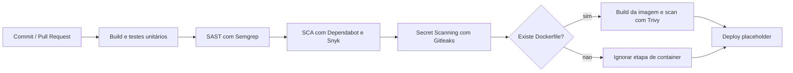

# Pipeline DevSecOps do AutoSpec API

## Inventário do repositório

- Build tool: Maven, a partir do arquivo [pom.xml](../pom.xml).
- Remote Git: `origin` em `https://github.com/gutomend/Sprint3-SOA_WebServices.git`.
- Stack principal: Spring Boot, Spring Web MVC, Spring Security, Spring Data JPA, Flyway, PostgreSQL, JJWT e Springdoc OpenAPI.
- Segurança de aplicação: autenticação com JWT, senha com BCrypt e autorização por perfis.
- Perfis atuais no código: `ADMIN` e `ANALISTA`.
- Não há `Dockerfile` no workspace neste momento, então a etapa de container security fica condicionada à sua criação.

## Dependências principais

As dependências mais relevantes para o pipeline são:

- `spring-boot-starter-data-jpa`
- `spring-boot-starter-flyway`
- `spring-boot-starter-validation`
- `spring-boot-starter-webmvc`
- `flyway-database-postgresql`
- `postgresql`
- `spring-boot-starter-security`
- `spring-security-crypto`
- `jjwt-api`
- `jjwt-impl`
- `jjwt-jackson`
- `springdoc-openapi-starter-webmvc-ui`
- `spring-boot-starter-test` e dependências de teste associadas

Essas bibliotecas tratam a API, persistência, migrações, segurança e documentação. Por isso, vulnerabilidades nelas impactam diretamente autenticação, autorização, exposição de dados e estabilidade da aplicação.

## O que cada etapa do pipeline faz

### 1 Build e testes unitários

Executa `mvn clean test` para compilar a aplicação e validar os testes automatizados.

Risco reduzido:

- Quebra funcional introduzida por mudanças de código.
- Erros de compilação.
- Regressões em autenticação, autorização e regras de negócio.

Aplicação no AutoSpec:

- Garante que os fluxos de login, JWT, controle de acesso e operações sobre veículos não sejam quebrados antes de qualquer análise mais cara.
- É importante porque a API lida com dados técnicos e dados de usuários com perfis distintos.

### 2) SAST com Semgrep

O Semgrep faz análise estática do código-fonte Java procurando padrões inseguros.

Risco reduzido:

- Falhas de lógica insegura.
- Validações ausentes ou fracas.
- Uso incorreto de APIs de segurança.
- Possíveis vetores de injeção e exposição de segredos no código.

Aplicação no AutoSpec:

- Ajuda a detectar problemas em controllers, services e configurações de segurança antes do deploy.
- É especialmente útil em uma API com JWT, filtros de autenticação e autorização por perfil.
- No contexto do Ford Challenge, protege operações que envolvem perfis com níveis de privilégio diferentes, como o equivalente funcional de Brigadista, Gestor e Administrador.

### 3) SCA com Dependabot e Snyk

O Dependabot monitora dependências Maven e abre pull requests automáticos quando surgem versões mais novas ou correções de segurança. O Snyk, quando habilitado com `SNYK_TOKEN`, faz varredura de vulnerabilidades conhecidas nas dependências.

Risco reduzido:

- Uso de bibliotecas com CVEs conhecidas.
- Vulnerabilidades transitivas em dependências indiretas.
- Atraso na atualização de pacotes de segurança.

Aplicação no AutoSpec:

- O projeto depende de Spring Boot, JJWT, PostgreSQL driver e Flyway. Qualquer CVE nessas bibliotecas pode afetar autenticação, persistência, migração ou tratamento de requisições.
- Em uma API com dados sensíveis de usuários e perfis, uma dependência vulnerável pode facilitar escalada de privilégio, vazamento de dados ou execução indevida de código.

### 4) Secret Scanning com Gitleaks

O Gitleaks inspeciona o repositório em busca de credenciais, chaves e tokens expostos por engano.

Risco reduzido:

- Vazamento de secrets em commits.
- Exposição de chaves JWT, senhas de banco, tokens de integração e credenciais de nuvem.

Aplicação no AutoSpec:

- O projeto usa autenticação JWT e acesso a banco de dados. Isso exige proteção rigorosa de segredos de assinatura, credenciais de conexão e qualquer token operacional.
- Em uma API que controla acesso por perfil, um segredo vazado pode comprometer todo o modelo de autorização.

### 5) Container Security com Trivy

Esta etapa só roda se existir `Dockerfile`. O Trivy analisa a imagem Docker em busca de CVEs no sistema operacional e nas bibliotecas empacotadas.

Risco reduzido:

- Imagens com pacotes vulneráveis.
- Base images desatualizadas.
- Dependências empacotadas com falhas conhecidas.

Aplicação no AutoSpec:

- Se a API for containerizada no futuro, a imagem será uma nova superfície de ataque.
- O scan ajuda a impedir que uma imagem com vulnerabilidades conhecidas seja promovida para ambiente de homologação ou produção.

### 6) Deploy placeholder

É um passo documentado para a próxima fase do pipeline. No estado atual, ele apenas sinaliza onde o deploy real deve entrar.

Risco reduzido:

- Deploy manual sem rastreabilidade.
- Falta de gate de qualidade entre segurança e publicação.

Aplicação no AutoSpec:

- Serve como ponto de integração para um futuro ambiente real, como Kubernetes, Cloud Run, App Service ou outro destino definido pelo time.

## Diagrama do pipeline

## Como isso se encaixa no Ford Challenge

O AutoSpec é uma API/backend que manipula autenticação, autorização e dados relacionados a veículos e usuários. Nesse tipo de sistema, a superfície de risco é concentrada em três pontos:

- Identidade e acesso: login, JWT e perfis.
- Integridade da aplicação: código e bibliotecas de terceiros.
- Segredos operacionais: credenciais de banco, tokens e chaves.

O pipeline proposto reduz esses riscos em camadas:

- O build/teste valida que a aplicação continua funcional.
- O Semgrep reduz falhas de implementação que podem afetar controle de acesso e validação de entrada.
- O Dependabot e o Snyk reduzem o risco de bibliotecas vulneráveis.
- O Gitleaks evita a exposição de credenciais.
- O Trivy protege a etapa de containerização, quando ela existir.

Se o projeto passar a usar Docker, basta adicionar um `Dockerfile` para ativar a etapa de container security do workflow.
